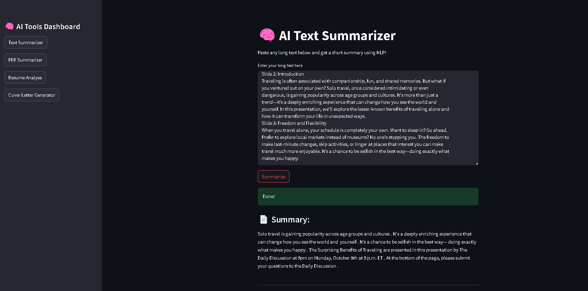
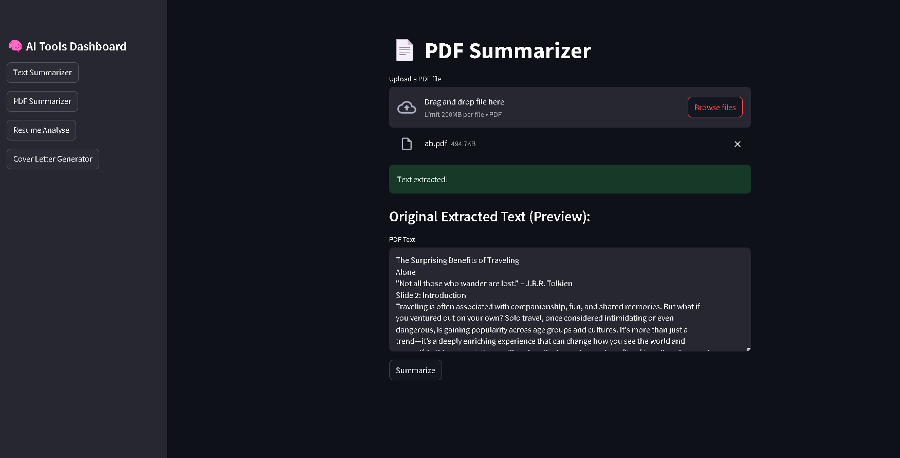
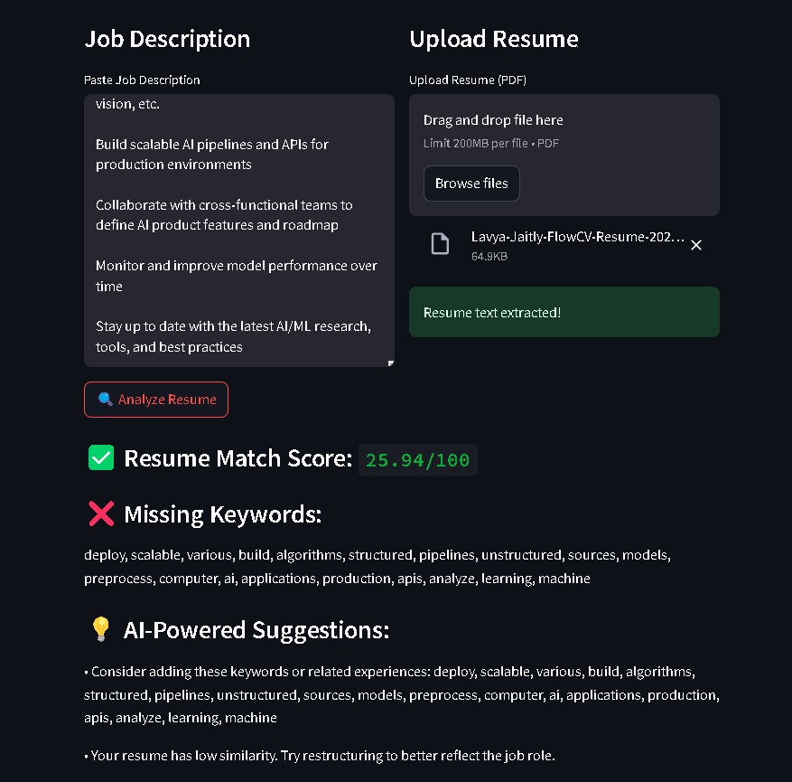

# AI Tools Dashboard (Streamlit)

A simple Streamlit-based dashboard that brings together multiple AI tools:

- 📝 AI Text Summariser
- 📄 PDF Summarizer
- 📂 Resume Analyser
- 🧠 **CLG Tool (Bullet Point Enhancer)** – Improves and rewrites bullet points for clarity and impact.


## Table Content 

## 📁 Files

| File                | Description                                   |
|---------------------|-----------------------------------------------|
| `app.py`            | Main dashboard with sidebar and tool routing  |
| `ai_summariser.py`  | AI text summarization tool                    |
| `pdf_summarizer.py` | Summarizes PDF documents                      |
| `resume_analyser.py`| Analyzes resumes vs job descriptions          |
| `clg.py`            | Bullet point enhancer (CLG Tool)              |


## 🖼️ Screenshots

### 🔹 Dashboard Home


### 🔹 PDF Summarizer


### 🔹 Resume Analyzer


### 🔹 Bullet Point Enhancer (CLG Tool)


## 🔧 Features

- Clean sidebar-based navigation using `st.session_state`
- Modular script structure (each tool in its own file)
- Easy to extend with more tools

## 🚀 Run Locally


Note : For CLG.py User would require their own cohere API Key currently (Groq)

### 1. Clone the repository

```bash
git clone https://github.com/LJGhost/Ai-Bridge.git
cd AiBridge
